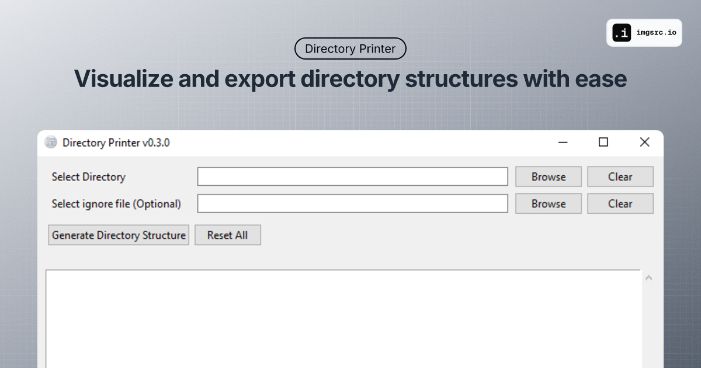

# Directory Printer

A GUI application for viewing and exporting directory structures. This tool provides a simple and intuitive way to visualize the structure of directories and their contents.

Check out this short video demonstration of Directory Printer in action:

## Features

- Interactive GUI for directory selection
- Copy directory tree to clipboard
- Export directory structure to text files
- Smart file filtering using standard ignore patterns (.gitignore, .dockerignore) to exclude unwanted files and directories
- Tree-like visualization of directory structures
- Handles permission errors gracefully
- Cross-platform compatibility (Windows, Linux, macOS)
- Multi-language support (English, Spanish, Chinese)
- Progress tracking with status indicators
- Recent files history
- Configurable settings with persistent storage
- Built-in update checker

## Installation

### Download Binary (Recommended)

Download the latest release for your operating system from the [Releases page](https://github.com/ysskrishna/directory-printer/releases).

- Windows: Download and extract `directory-printer-windows-<version>.zip`
- Linux: Download and extract `directory-printer-linux-<version>.zip`
- macOS: Download and extract `directory-printer-macos-<version>.zip`

> 👩‍💻 **Are you a developer?** If you want to build from source or contribute to the project, please check out our [Development Guide](DEVELOPMENT.md).

## FAQ

### Why do I see a warning about an unidentified developer on macOS?

On macOS, you may see a warning that the application is from an unidentified developer. This is because the application is not signed with an Apple Developer Certificate. To bypass this warning:

1. Right-click on the application
2. Select "Open"
3. Click "Open" in the confirmation dialog

The application will now run without the warning.

### How can I change the application language?

You can change the application language through the `File` menu:

1. Click on `File` in the menu bar
2. Look for the language selection option
3. Choose your preferred language (English, Spanish, or Chinese)

The application will remember your language preference for future sessions.

### How do I check for updates?

You can check for new versions of Directory Printer through the `Help` menu:

1. Click on `Help` in the menu bar
2. Select `Check for Updates`
3. The application will notify you if a new version is available

### Why do I see a warning about an unknown publisher on Windows?

On Windows, you may see a warning that the application is from an unknown publisher. This is because the application is not signed with a code signing certificate. To bypass this warning:

1. Click "More info"
2. Click "Run anyway"

The application will now run without the warning.

### Why do I see a warning about an untrusted application on Linux?

On Linux, you may see a warning that the application is untrusted. This is because the application is not signed with a code signing certificate. To bypass this warning:

1. Right-click on the application
2. Select "Properties"
3. Navigate to the "Permissions" tab
4. Check the box next to "Allow executing file as program"

The application will now run without the warning.

## License

Copyright (c) 2025 [Y. Siva Sai Krishna](https://github.com/ysskrishna)

This project is licensed under the GNU Affero General Public License v3.0 (AGPL-3.0).
